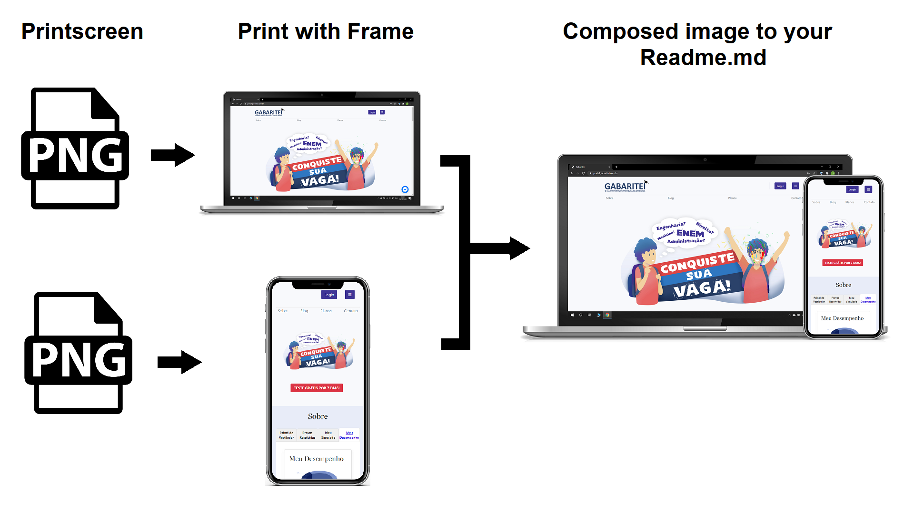

<h2 align="center">
    Image Creator to your Repository Cover
      
    
</h2>

  <a href="#-technology">Technology</a>&nbsp;&nbsp;&nbsp;|&nbsp;&nbsp;&nbsp;
  <a href="#-project">Project</a>&nbsp;&nbsp;&nbsp;|&nbsp;&nbsp;&nbsp;
  <a href="#-example">Example</a>&nbsp;&nbsp;&nbsp;|&nbsp;&nbsp;&nbsp;
  <a href="#memo-license">License</a>

 

  

 

  

## 🚀 Technology

This project uses:

- [Python](https://python.org/)
- [PIL - Python Imaging Library](https://www.pythonware.com/products/pil/)

## 💻 Project

This project helps you to create a nice image as cover to your project in Github.
 
You can use a desktop and/or mobile print screen and compose an image that shows to visitors your project.

## 🔖 Example

This is how the code works:
You take a printscreen from your mobile and/or your desktop page or app, this code put a frame.
 
If your code has differences between mobile and desktop versions, you can combine to a new image showing the two versions side by side.
 
Since the code is not ready yet, you need to execute the PC_Image_Creator.py, then Smart_Image_Creator.py and then Img_Combine.py

  

## :memo: License

MIT

---

By Matheus Ruggeri
